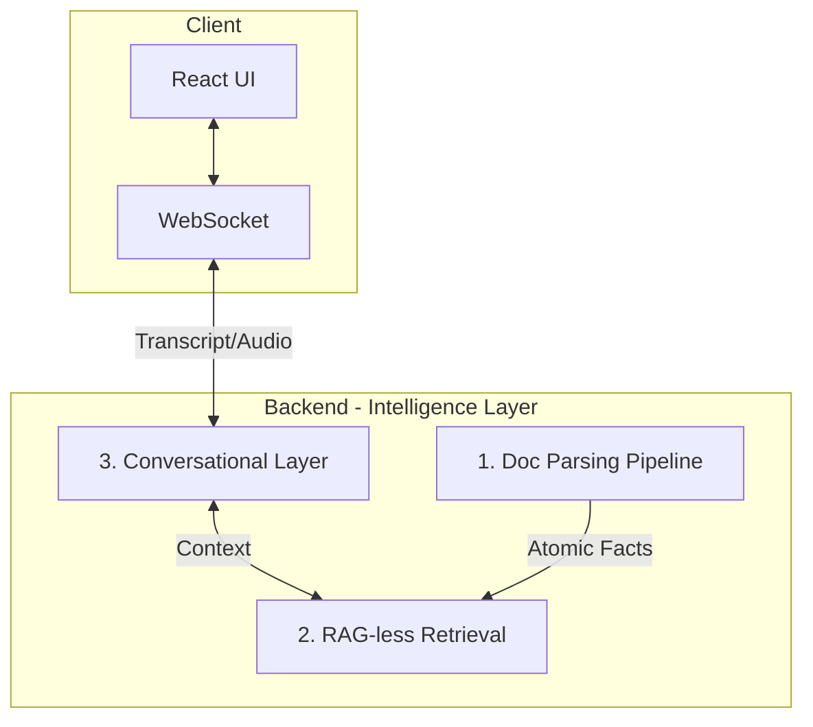
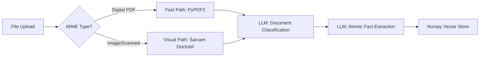
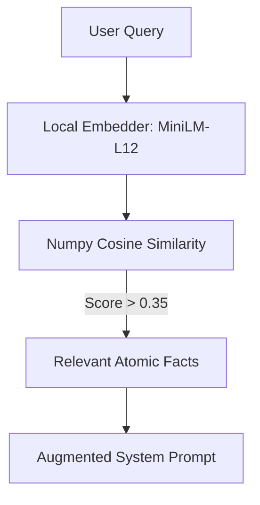
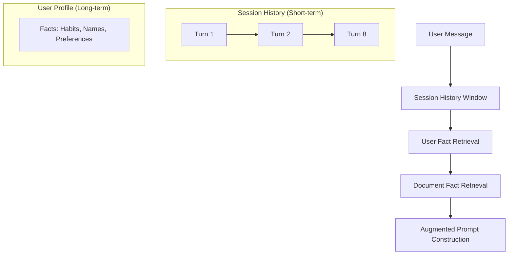

# Vaani 🎙️

Vaani is a production-ready, ultra-low latency multilingual voice agent platform. It transforms standard AI interactions into stateful, context-aware productivity sessions through a custom "Intelligence Layer" that combines RAG-less knowledge retrieval, multi-turn conversational memory, and intelligent document parsing.

---

## 🏛️ System Architecture

Vaani decoupled architecture ensures sub-second latency while maintaining high precision across multiple Indian languages.

---

## 1. 📄 Intelligent Document Parsing Pipeline
Vaani handles everything from digital PDFs to messy, hand-written receipts using a hybrid ingress pipeline.

### The Pipeline Flow

- **Visual Fidelity**: Uses `Sarvam DocIntel` for OCR, layout analysis, and Markdown conversion of scanned documents.
- **Auto-Classification**: Documents are categorized (e.g., *Invoice*, *Legal*, *Personal*) to adjust the grounding intensity.
- **Extraction vs. Chunking**: Instead of naive text splitting, we use `sarvam-105b` to distill the document into 10-20 stand-alone, searchable truths (Atomic Facts).

---

## 2. ⚡ RAG-less Hybrid Retrieval
Traditional RAG (Retrieval-Augmented Generation) is often slow and noisy. Vaani's **RAG-less** architecture optimizes for speed and precision.

### The Architecture

- **Local-First**: Embeddings are computed and searched locally using `numpy` and `sentence-transformers`. No external Vector DB latency.
- **Atomic Facts**: Because we retrieve clean "facts" (e.g., *"The invoice total is ₹5,400"*) instead of raw text chunks, the LLM avoids hallucinations and stays focused.
- **Cross-Language**: The pre-cached `paraphrase-multilingual` model allows a query in Hindi to retrieve facts extracted from an English document.

---

## 3. 🧠 Conversational Memory Layer
Vaani remembers who you are across sessions and context across turns.

### The Memory Hierarchy

- **Short-term Memory**: A sliding window of the last 8 turns is maintained in memory for immediate context.
- **Long-term Fact Extraction**: After every turn, an async task analyzes the conversation to extract permanent user details (e.g., *"User prefers meeting summaries in Hindi"*).
- **Graceful Persistence**: User facts are persisted as local JSON and capped to maintain sub-20ms prompt construction times.

---

## 🛠️ Getting Started

### Prerequisites
- Node.js (v20+)
- Python (3.10+)
- [Sarvam AI API Key](https://sarvam.ai/)

### Setup
Please refer to the separate [Backend Setup](file:///e:/Projects/Vaani/backend/README.md) and [Frontend Setup](file:///e:/Projects/Vaani/frontend/README.md) guides for installation details.

---
*© 2026 Vaani AI. A Voice-First Productivity Platform.*
