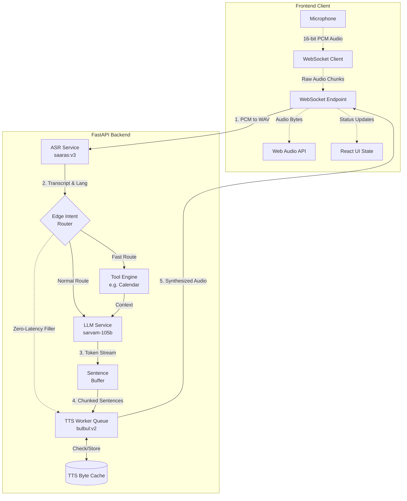

# Vaani 🎙️

Vaani is a production-ready, ultra-low latency multilingual voice agent platform optimized for Indian languages. Vaani is designed to provide seamless, real-time voice interactions with sub-second latency through an advanced, decoupled streaming pipeline and an orchestration of powerful language models.

By leveraging Sarvam AI's localized models, Vaani bridges the gap between state-of-the-art linguistic processing and premium, responsive user interfaces, creating a full-duplex conversational pipeline capable of understanding, reasoning, and speaking natively.

---

## 🏛️ System Architecture

Vaani operates seamlessly across a sleek Next.js client and a heavily optimized Python backend. The architecture prioritizes **Time to First Byte (TTFB)** and **Time to Interaction (TTI)**, utilizing async streams, caching, and edge routing to minimize perceived latency.



### Components

1. **Frontend:** A high-fidelity Next.js 16 & React 19 app styled with Tailwind CSS v4. Prioritizes state-driven UI (idle, processing, thinking, speaking) and secure WebSocket transmission using the `MediaRecorder` API.
2. **Backend:** An async FastAPI server running on Uvicorn. Decouples ASR, LLM, and TTS generation using worker queues and WebSockets (`wsproto`) for continuous bidirectional streaming.

---

## ⚡ The Streaming Pipeline

Our sub-800ms pipeline doesn't wait for complete models to finish executing. Instead, it processes fragments of conversation concurrently.

### 1. Ingestion & ASR
- The browser captures raw 16kHz, 16-bit PCM audio chunks and streams them via WebSocket.
- The Python server dynamically reconstructs the WAV headers (`pcm_to_wav`) in memory. 
- The audio is dispatched to Sarvam AI (`saaras:v3`) which detects the language and returns the transcript.

### 2. Edge Intent Routing & Zero-Latency Masking
- The backend evaluates the transcript strictly against fast-match intents (e.g., *Check Calendar*).
- **Latency Masking:** If a tool execution is required, the server instantly pipes a pre-cached filler audio chunk (e.g., *"एक मिनट, मैं चेक करती हूँ।"*) back to the user via TTS Byte Caching, making the agent feel instant.
- Tool payloads (like fetching Google Calendar events) are executed in the background without blocking the user interface.

### 3. Asynchronous LLM Token Streaming
- The prompt is routed to `sarvam-105b`. Instead of waiting for the full response, tokens stream back via an `async generator`.

### 4. Smart Sentence Buffering
- Native tokens are piped into a custom **regex sentence buffer**.
- It aggressively splits strings based on grammatical and linguistic end-markers, including English `[.,?!:\n]` and regional markers like the Hindi Purna Viram `[।]`.
- This ensures that only complete, syntactically correct clauses are sent to the TTS engine to preserve natural prosody.

### 5. Concurrent TTS Synthesis & Caching
- Buffered grammatical clauses are popped onto an `asyncio.Queue`.
- The background **TTS Worker** (`bulbul:v2`) picks these up sequentially.
- A **TTS Byte Cache** evaluates if the phrase is standard. Pre-cached words bypass the slow network requests entirely.
- Synthesized audio chunks are immediately piped backwards to the client as they are generated. 

---

## 🛠️ Technical Stack

**Frontend**
- **Framework:** Next.js 16, React 19
- **Design:** Tailwind CSS v4, custom cursor-inspired typography
- **Auth:** Firebase Auth
- **Audio IO:** Web Audio API, `MediaRecorder`

**Backend**
- **Framework:** FastAPI, Uvicorn, WebSockets (`wsproto`)
- **AI Core:** Sarvam AI SDK 
- **Concurrency:** `asyncio` for workers and event loops, native streaming generators.

---

## 🚀 Getting Started

### Prerequisites
- Node.js (v20+)
- Python (3.10+)
- A [Sarvam AI API Key](https://sarvam.ai/)

### Backend Setup

1. Navigate to the `backend` directory:
   ```bash
   cd backend
   ```
2. Install dependencies:
   ```bash
   pip install -r requirements.txt
   ```
3. Set your environment variables in `backend/.env`:
   ```env
   SARVAM_API_KEY="your_sarvam_api_key_here"
   ```
4. Start the Uvicorn server:
   ```bash
   python main.py
   ```
   *(Backend starts at `ws://127.0.0.1:8000/voice-agent`)*

### Frontend Setup

1. Navigate to the `frontend` directory:
   ```bash
   cd frontend
   ```
2. Install dependencies:
   ```bash
   npm install
   ```
3. Run the development server:
   ```bash
   npm run dev
   ```
4. Open [http://localhost:3000](http://localhost:3000)

---
*© 2026 Vaani AI. A Voice-First Productivity Platform.*
