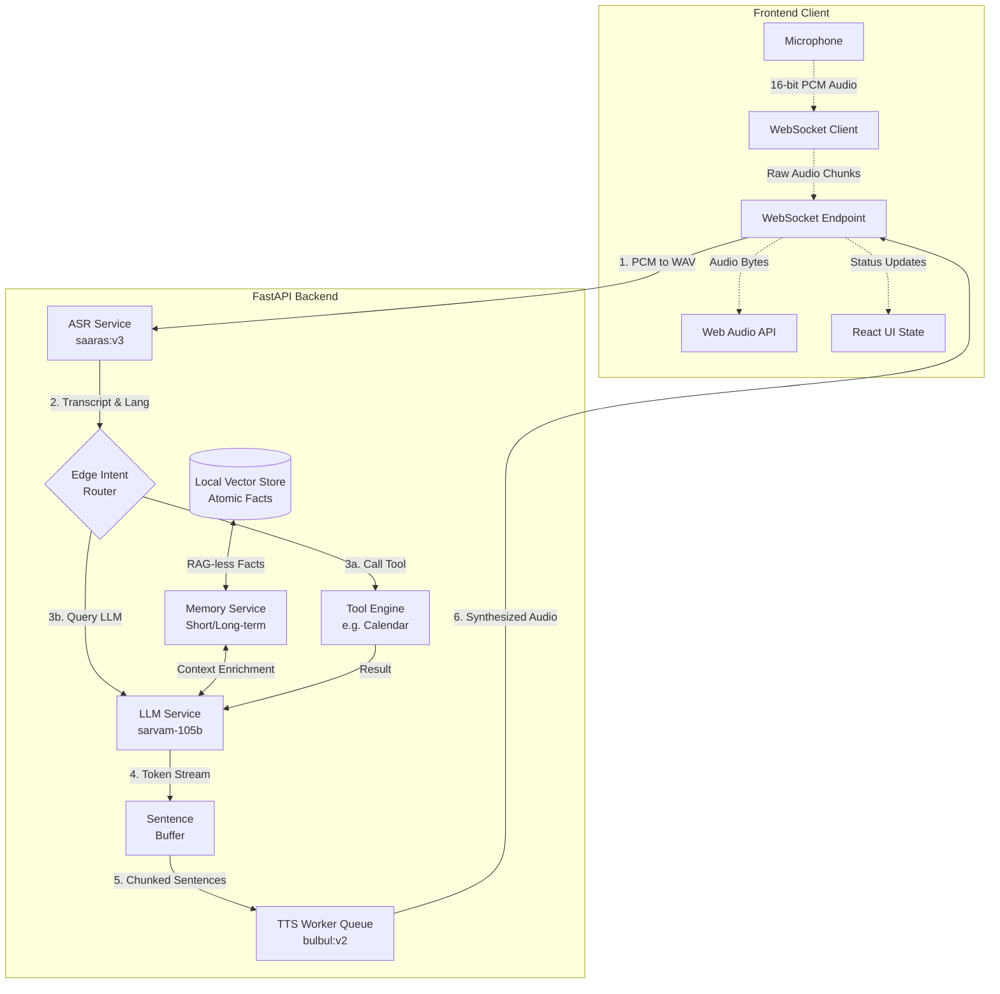

# Vaani 🎙️

Vaani is a production-ready, ultra-low latency multilingual voice agent platform optimized for Indian languages. Vaani is designed to provide seamless, real-time voice interactions with sub-second latency through an advanced, decoupled streaming pipeline and an orchestration of powerful language models.

By leveraging Sarvam AI's localized models, Vaani bridges the gap between state-of-the-art linguistic processing and premium, responsive user interfaces, creating a full-duplex conversational pipeline capable of understanding, reasoning, and speaking natively.

---

## 🏛️ System Architecture

Vaani operates seamlessly across a sleek Next.js client and a heavily optimized Python backend. The architecture prioritizes **Time to First Byte (TTFB)** and **Time to Interaction (TTI)**, utilizing async streams, caching, and edge routing to minimize perceived latency.

---

## 🧠 The Intelligence Layer

Vaani isn't just a voice-to-text wrapper; it possesses a stateful "brain" that remembers your habits and reasons over your documents.

### ⚡ RAG-less Hybrid Retrieval
Traditional RAG (Retrieval-Augmented Generation) often suffers from "chunking noise" and high latency. Vaani implements a **RAG-less** alternative:
- **Extraction-First:** Instead of storing raw text chunks, we use `sarvam-105b` to extract **atomic facts** (stand-alone truths) at upload time.
- **Local Vector Search:** Facts are embedded once using a local transformer (`paraphrase-multilingual-MiniLM-L12-v2`) and stored in a lightweight `numpy` store.
- **Micro-Latency:** Retrieval happens in **<2ms**, providing the LLM with clean, high-signal facts without the overhead of an external vector database.

### 🧠 Conversational Memory Layer
Vaani maintains a persistent identity through a tri-tier memory system:
1.  **Short-term (Session):** A sliding window of the last 8 turns (16 messages) to maintain coherent multi-turn dialogue.
2.  **Long-term (User Facts):** After every turn, the agent autonomously extracts permanent user details (e.g., *"User's daughter is named Ananya"*) to a local persistent store.
3.  **Knowledge (Documents):** Relevant facts from your uploaded documents are injected into the system prompt based on semantic similarity to the current turn.

### 📄 Intelligent Document Understanding
A hybrid processing path ensures 100% fidelity across all document types:
- **Fast Path:** Digital PDFs are parsed instantly using `PyPDF2` with zero API cost.
- **Visual Path:** Scanned documents, receipts, and images are processed via **Sarvam Document Intelligence** (OCR + Layout analysis).
- **Classification:** Every document is automatically classified (Invoice, Report, Letter, etc.) to tailor the fact extraction prompt.

---

## ⚡ The Streaming Pipeline

Our sub-800ms pipeline processes fragments of conversation concurrently.

### 1. Ingestion & ASR
- The browser captures raw 16kHz, 16-bit PCM audio chunks and streams them via WebSocket.
- The Python server reconstructs WAV headers in memory and dispatches to `saaras:v3`.

### 2. Edge Intent Routing & Zero-Latency Masking
- The backend evaluates the transcript against fast-match intents.
- **Latency Masking:** If a tool execution is required, the server instantly pipes a pre-cached filler audio chunk (e.g., *"एक मिनट, मैं चेक करती हूँ।"*) back to the user.

### 3. Asynchronous LLM Token Streaming
- The prompt is routed to `sarvam-105b`. Tokens stream back via an `async generator`.

### 4. Smart Sentence Buffering
- Native tokens are piped into a custom **regex sentence buffer** that aggressively splits based on grammatical markers (e.g., `.` or Hindi `।`).

---

## 🛠️ Technical Stack

**Frontend**
- **Framework:** Next.js 16, React 19
- **Design:** Tailwind CSS v4, custom cursor-inspired typography
- **Auth:** Firebase Auth
- **Audio IO:** Web Audio API, `MediaRecorder`

**Backend**
- **Framework:** FastAPI, Uvicorn, WebSockets
- **AI Core:** Sarvam AI SDK (`sarvam-105b`, `saaras:v3`, `bulbul:v2`)
- **Memory:** Local `numpy` Vector Store, Persistent JSON

---

## 🚀 Getting Started

### Prerequisites
- Node.js (v20+)
- Python (3.10+)
- A [Sarvam AI API Key](https://sarvam.ai/)

### Backend Setup
1. `cd backend`
2. `pip install -r requirements.txt`
3. Set `SARVAM_API_KEY` in `backend/.env`.
4. Run `python main.py`.

### Frontend Setup
1. `cd frontend`
2. `npm install`
3. `npm run dev`

---
*© 2026 Vaani AI. A Voice-First Productivity Platform.*
